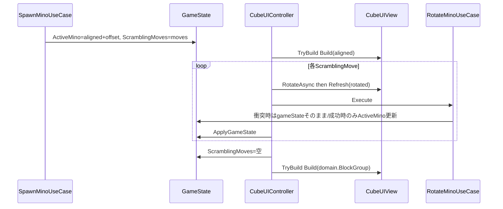

# スクランブルと回転キャンセルの整合調査レポート

## 1. データフローの整理

---

## 2. SpawnMinoUseCase：モデルと手順リストの関係

ソース: `[Assets/Scripts/Application/UseCases/SpawnMinoUseCase.cs](Assets/Scripts/Application/UseCases/SpawnMinoUseCase.cs)`

| 項目                           | 実装                                                                                                               |
| ---------------------------- | ---------------------------------------------------------------------------------------------------------------- |
| ランダム回転の記録                    | `cube.CanRotate(op, pivot)` が **true のときだけ** `moves.Add` し `cube = cube.Rotate(...)`                             |
| 最終形状の検証                      | `rotatedMino = aligned.WithBlockGroup(cube).WithOffset(spawnOffset)` に対し `**rotatedMino.IsColliding(Field)`** のみ |
| **GameState に載る ActiveMino** | `**alignedMino.WithOffset(spawnOffset)`**（**回転前**のブロック群＋同一オフセット）                                                 |

つまり **ドメイン上の初期姿勢は「工場出荷の向き（aligned）」** で、`**ScramblingMoves` は「その aligned から順に回すと Spawn 内の `cube` と同じになるはず」の手順**。

一方 `**ComputeSpawnOffset` は `rotatedMino`（回転後形状）のバウンディング**に基づいて Clamp している（60行付近）。**同じオフセットを aligned に適用すると、AABB が異なる**ため、**「回転後はウェル内だが、aligned ははみ出す／逆」**になり得る。これは **再生中の `IsColliding` が Spawn 時の最終チェックと別物**になりやすい土台になる。

参考: `[UseCase_SpawnMino.md](Docs/Application/UseCases/UseCase_SpawnMino.md)` §4 のフローは「回転後を ActiveMino に反映」と読めるが、**実装は aligned + `ScramblingMoves` の遅延反映**であり、**ドキュメントと実装が一致していない**（§7 以降の「演出は Presentation」系ドキュメントの方が実態に近い）。

---

## 3. 回転キャンセル：Spawn の判定と再生の判定が一致しない

| 層              | 判定                                                                                                                                                    |
| -------------- | ----------------------------------------------------------------------------------------------------------------------------------------------------- |
| Spawn で手順に載せるか | `**Cube.CanRotate`**（ブロック同士のオーバーラップのみ）                                                                                                                |
| 再生で採用するか       | `**RotateMinoUseCase` → `ActiveMino.IsColliding(Field)**`（`[RotateMinoUseCase.cs](Assets/Scripts/Application/UseCases/RotateMinoUseCase.cs)` 25–26 行） |

`[ActiveMino.IsColliding](Assets/Scripts/Domain/Tetris/ActiveMino.cs)` は **Z=Field.MinZ のセルだけ**を対象にし、`Field.Contains` と既存ブロックを見る。**Spawn は各ステップでフィールド衝突をシミュレートしていない**ため、**手順上は `CanRotate` が通るが、再生では `IsColliding` で弾かれる**ケースが起こりうる。

その結果、**リスト上の一部の回転がドメインでは一切進まない**のに、次の項のとおり **ビューだけ進む**可能性がある。

---

## 4. CubeUIController：ビュー先行と GameState 不整合（回転キャンセル時）

ソース: `[Assets/Scripts/Presentation/Views/Gameplay/CubeUIController.cs](Assets/Scripts/Presentation/Views/Gameplay/CubeUIController.cs)` `ExecuteRotateCoreAsync`（65–74 行付近）

1. `RotateAsync` → 2. `Refresh(rotatedCube, positionMap)` → 3. `RotateMinoUseCase.Execute` → 4. `ApplyGameState`

**衝突で `RotateMinoUseCase` が元の `gameState` を返す場合でも、`Refresh` は既に回転後の見た目にしている。** ドメインは **未回転のまま**。

加えて、同一 `GameState` / 同一 `ActiveMino` 参照のまま `ApplyGameState` すると、`TryBuildFromState` は `**ReferenceEquals(_lastActiveMinoRef, active)` で早期 return**（121–122 行）し、**Build でビューを元に戻さない**経路がある。購読側の通知省略と合わせ、**「アニメ＋Refresh だけ進み、モデルはキャンセル」**が固定化されやすい。

---

## 5. スクランブル終了時の Build：一括で「ドメインに引きずられる」見え方

`PlayScramblingAsync` 終了時（100–101 行）は `**ScramblingMoves` を空にするだけ**で、`ActiveMino` を **Spawn 時の `rotatedMino` に上書きする処理はない**。

直後の `OnGameStateChanged` で `state.ScramblingMoves.Count == 0` となり、`[TryBuildFromState](Assets/Scripts/Presentation/Views/Gameplay/CubeUIController.cs)` 139–144 行の分岐で `**Build(active.BlockGroup)`** が走る。**ドメインが最終的にどの段階まで進んでいるか**で、キューブ全体が **一気に組み直される**。

- 再生中に **一部の回転が `IsColliding` で弾かれていた**場合、**ドメインは途中の向きのまま**だが、**直前まで Refresh で見た目だけ進んでいた**と、**Build で一気にドメイン側の形に戻る** → **「巻き戻したように見える」「同じ操作を二度取り消したような」体感**になりうる。
- **初回のプレイヤー回転**は、この時点の `**GameState.ActiveMino.BlockGroup`（ドメイン）** を起点に `[ExecuteRotateCoreAsync](Assets/Scripts/Presentation/Views/Gameplay/CubeUIController.cs)` が動く。**画面上のキューブとドメインがずれていれば**、**「全く違う形状に変化」**に見える。

---

## 6. Initialize 順のエッジケース（スクランブル再生が始まらない可能性）

`OnGameStateChanged` の再生条件（82–83 行）は  
`state.ScramblingMoves.Count > 0 && prevScramble == 0`。

`Initialize`（38–40 行）では **購読前に** `_previousScramblingMovesCount = current.ScramblingMoves.Count` としている。**初回から既に `ScramblingMoves` が非空の状態で `Initialize` だけが遅れて走る**と、`prevScramble != 0` となり `**PlayScramblingAsync` が起動しない**可能性がある（通常の「空 → スポーンで moves 付与」の順序では問題化しにくい）。

---

## 7. その他（関連ファイル）

- **FieldUIView** は `GameState` 購読で平面表示。**ドメインの `ActiveMino` とズレた `CubeUIView` とは別経路**のため、**キューブとフィールド平面でさらに食い違い**が出やすい。
- **キー入力**（`[CubeInputDetector](Assets/Scripts/Presentation/InputDetectors/CubeInputDetector.cs)` 等）は `ScramblingMoves.Count == 0` まで無視。**スクランブル中のプレイヤー入力は主因ではない**想定。

---

## 8. 結論（原因の整理）

| 現象の予想に対応する要因              |
| ------------------------- |
| **回転キャンセルが効いていないのでは**     |
| **同じ回転を巻き戻すように見える**       |
| **スクランブル後の最初の回転で形状がおかしい** |

**修正方針の議論**は本レポートの範囲外だが、整合を取るには例えば次のいずれかが必要になる: (a) Spawn の手順生成時に **各ステップで `IsColliding` も満たす**ようにする、(b) 再生で衝突時は **Refresh を適用しない／ロールバックする**、(c) スクランブル完了時に **ドメインを `rotatedMino` に確定**する、(d) `**aligned` と `spawnOffset` の組み合わせ**を幾何的に一貫させる、等。